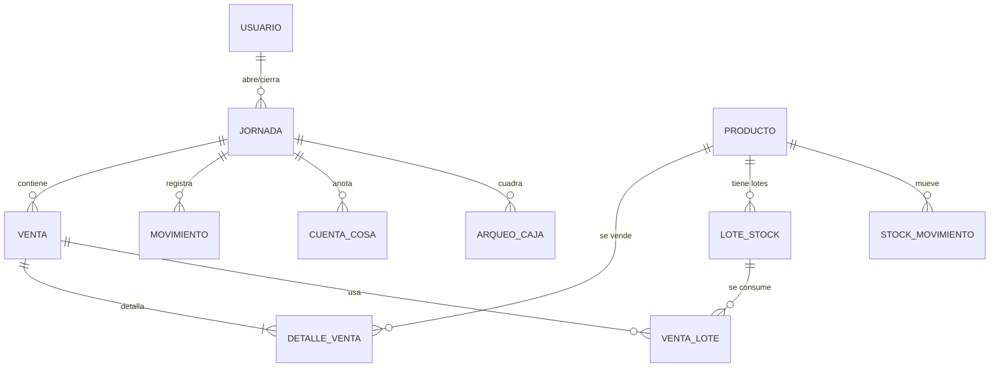

# Mipime-Cuentas — Tienda App

Sistema de punto de venta (POS) para pequeños comercios, 100 % local y sin backend.
Toda la data vive en SQLite: en el navegador (SQLocal + OPFS), en escritorio
(Electron + better-sqlite3) y en móvil (Capacitor + WebView).

- **Web**: corre en el navegador, la base persiste en OPFS.
- **Desktop**: instalador nativo para Windows / macOS / Linux (Electron).
- **Móvil**: Android / iOS vía Capacitor.

## Stack

| Capa | Tecnología |
|------|-----------|
| Framework | Angular 21 (standalone, signals) |
| Estilos | Tailwind CSS 4 |
| Base de datos | SQLite — SQLocal (web) / better-sqlite3 (Electron) / WebView (móvil) |
| Migraciones | Runner propio, schema v17 + seed condicional (74 productos reales) |
| Tests | Vitest + jsdom |
| Lint | ESLint (0 errores / 0 warnings) |
| Package manager | Bun |
| Build | Angular CLI + Vite |
| Desktop | Electron + electron-builder + auto-updater |
| Móvil | Capacitor 8 |
| Reportes | Excel (XLSX) + PDF (jsPDF) |

## Estructura del proyecto

```
src/
└── app/
    ├── app.ts                    # Root component + nav
    ├── app.config.ts             # Providers (router, DB, auth)
    ├── app.routes.ts             # Definición de rutas + guards
    │
    ├── models/                   # Interfaces de datos
    │
    ├── services/                 # Lógica de negocio + DB
    │   ├── database.ts           # Contrato Database (InjectionToken)
    │   ├── sqlite.service.ts     # SQLocal (web) + transacciones re-entrantes
    │   ├── native-sqlite.service.ts  # IPC → better-sqlite3 (Electron)
    │   ├── db-migrations.ts      # Migraciones v1–v17 + seed
    │   ├── db-status.service.ts  # Salud de la DB (fatal / restore)
    │   ├── auth.service.ts       # Login, sesión con heartbeat
    │   ├── user.service.ts       # CRUD usuarios (admin)
    │   ├── cart.service.ts       # Carrito (signal)
    │   ├── venta.service.ts      # Registro atómico de ventas + FIFO
    │   ├── stock-movimiento.service.ts  # Entradas/salidas/ajustes/traslados/merma
    │   ├── cuenta-cosa.service.ts       # Cuenta cosas + salida de stock
    │   ├── cobro-pendiente.service.ts   # Cobro de pendientes (anti doble-cobro)
    │   ├── jornada.service.ts    # Apertura/cierre, arqueo, backups, Excel
    │   ├── producto.service.ts   # CRUD productos + inversión
    │   ├── excel.service.ts      # Generación de XLSX
    │   ├── backup.service.ts     # Backups rodantes + export
    │   └── theme.service.ts      # Dark mode
    │
    ├── guards/                   # auth.guard.ts, role.guard.ts, admin.guard.ts
    │
    ├── components/               # checkout-modal, cobro-pendiente-modal,
    │   │                         # quantity-input, cart-item-row, product-card,
    │   │                         # layout/app-nav, badges, estados UI, pantallas DB
    │   └── layout/
    │
    └── pages/
        ├── login/                # Inicio de sesión + reanudar jornada
        ├── pos/                  # Punto de venta + 5 formas de pago
        ├── inventario/           # Movimientos de stock, lotes, edición de producto
        ├── productos/            # Catálogo, inversión, merma
        ├── jornada/              # Estado del día, arqueo, cierre
        ├── historial/            # Jornadas cerradas + exportaciones
        └── admin/                # Gestión de usuarios (solo admin)
```

## Mapa de páginas

| Ruta | Página | Rol | Descripción |
|------|--------|-----|-------------|
| `/login` | Login | Todos | Inicio de sesión; si hay jornada abierta ofrece reanudar o cerrar |
| `/pos` | POS | Trabajador | Vender con búsqueda, carrito y modal de cobro |
| `/inventario` | Inventario | Admin + Trabajador | Entradas/salidas/ajustes/traslados, lotes, alta/edición de productos |
| `/productos` | Productos | Admin + Trabajador | Catálogo, inversión, registro de merma |
| `/jornada` | Jornada | Trabajador | Ver estado del día, movimientos, arqueo y cierre |
| `/historial` | Historial | Trabajador | Jornadas cerradas, vistas previas y exportación Excel |
| `/admin` | Admin | Admin | Crear/editar usuarios, roles, reset de contraseña |

## Roles y permisos

| Capacidad | Admin | Trabajador |
|-----------|:-----:|:----------:|
| Vender (POS, todas las formas de pago) | ✅ | ✅ |
| Cobrar pendientes / cuenta cosas / merma | ✅ | ✅ |
| Salidas y traslados de stock | ✅ | ✅ |
| Abrir/cerrar jornada + arqueo | ✅ | ✅ |
| Exportar Excel / ver historial | ✅ | ✅ |
| Alta/edición/eliminación de productos | ✅ | ❌ |
| Entradas de stock, ajustes y edición de lotes | ✅ | ❌ |
| Gestión de usuarios (`/admin`) | ✅ | ❌ |

## Funcionalidades principales

- **POS con 5 formas de pago**: efectivo, transferencia, divisas (USD/EUR con
  tasa y vuelto), pendiente (comprador + autorizado por) y cuenta cosas.
  Pago mixto con completación en efectivo y guard de saldo en caja.
- **Inventario FIFO por lotes**: stock dual (almacén/tienda), lotes por ubicación,
  entradas, salidas, ajustes, traslados y merma con costo real.
  Edición de producto con feedback del frente FIFO.
- **Jornada**: apertura con monto inicial, movimientos (gasto / ingreso extra /
  compra de divisa), total en caja en vivo, arqueo de 12 denominaciones con
  cuadre (SOBRANTE / FALTANTE / CUADRADO) y cierre con backup automático.
- **Reportes Excel**: cierre con 6+ hojas (Resumen, Ventas, Movimientos, Arqueo,
  Pendientes, IPVE), exportación por jornada, mensual multi-hoja y por rango.
- **Cobro de pendientes**: lista global con anti doble-cobro, cobro como venta solo-money.
- **Seguridad**: login con hash + salt, sesión con heartbeat, roles admin/trabajador.
- **Backups**: rodantes en apertura y cierre, export manual, restauración en UI.
- **Multiplataforma**: misma base de datos en web, escritorio y móvil.

## Modelo de datos

Schema actual v17. Tablas principales:

| Tabla | Rol |
|-------|-----|
| `usuarios` | Usuarios, roles (`admin`/`trabajador`), activo |
| `jornadas` | Apertura/cierre, saldos, totales por forma de pago, merma |
| `ventas` | Ventas con forma de pago, divisa, pendiente, cobro de pendiente |
| `detalle_ventas` | Líneas de cada venta |
| `lotes_stock` | Stock FIFO por producto, lote y ubicación |
| `venta_lotes` | Consumo de lotes por venta (costo FIFO real) |
| `stock_movimientos` | Entradas, salidas, ajustes, mermas, traslados |
| `movimientos` | Gastos, ingresos extra, compra de divisa |
| `cuenta_cosas` | Cuenta cosas por jornada |
| `arqueo_caja` | Conteo de billetes/monedas del arqueo |
| `jornada_reportes` | Excel de cierre persistido por jornada |
| `schema_version` | Versión del schema (17) |



## Desarrollo local

```bash
# Clonar
git clone https://github.com/maikolgarcialorenzo2001-rgb/Mipime-App.git
cd Mipime-App

# Instalar dependencias
bun install

# Servidor de desarrollo
bun run start

# Tests
bunx vitest run

# Lint
ng lint

# Build producción
bun run build
```

### Escritorio (Electron)

```bash
bun run electron:start          # ejecutar en modo dev
bun run electron:build:win      # instalador Windows (Tienda App Setup)
bun run electron:build:mac      # macOS
bun run electron:build:linux    # Linux
```

### Móvil (Capacitor)

```bash
bun run cap:sync                # sincronizar web → plataformas nativas
bun run cap:android             # abrir Android Studio
bun run cap:build:android       # build + sync android
```

## Versionado

SemVer con sufijos de entorno (`-alpha`, `-beta`). La versión vive en
`package.json` como única fuente de verdad y se sincroniza automáticamente
(title, badge del nav, instalador) en cada build. Ver [VERSIONING.md](VERSIONING.md).

```bash
npm run version:bump   # 0.1.15-beta → 0.1.16-beta (preserva sufijo)
```

## Convenciones del equipo

### Commits

Usamos [Conventional Commits](https://www.conventionalcommits.org/):

```
feat:      nueva funcionalidad
fix:       corrección de bug
refactor:  cambio que no agrega funcionalidad
test:      tests
docs:      documentación
chore:     tooling, dependencias, config, version bump
```

### Ramas

```
main                  → estable, siempre anda
feature/<nombre>      → features (PRs incrementales hacia main)
fix/<nombre>          → hotfixes / correcciones
```

Los PRs apuntan a `main`. Nunca se commitea directo a `main`.

## Documentación relacionada

| Documento | Contenido |
|-----------|-----------|
| [VERSIONING.md](VERSIONING.md) | Convención de versionado y sincronización |
| [docs/Fix-Inventario-Bugs.md](docs/Fix-Inventario-Bugs.md) | Plan de fixes del flujo de inventario (F1–F9) |
| [todo-mipime.md](todo-mipime.md) | Backlog y estado del proyecto |
| [mobile-roadmap.md](mobile-roadmap.md) | Roadmap de la app móvil |
| [workflow-pagar-pendiente.md](workflow-pagar-pendiente.md) | Flujo de cobro de pendientes |
