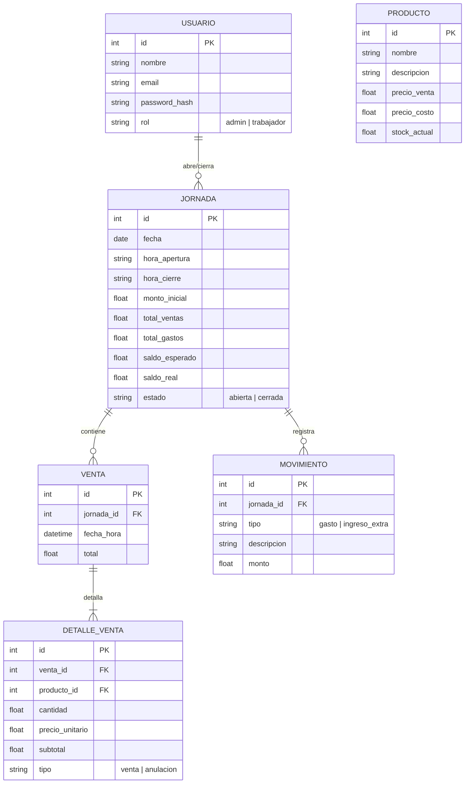

# Mipime-Cuentas

Sistema de punto de venta (POS) para pequeños comercios. Corré 100% en el navegador con SQLite (vía SQLocal) — no necesita backend ni instalación de base de datos.

## Stack

| Capa | Tecnología |
|------|-----------|
| Framework | Angular 21 |
| Estilos | Tailwind CSS 4 |
| Base de datos | SQLocal (SQLite via WASM en el browser) |
| Tests | Vitest + jsdom |
| Package manager | Bun |
| Build | Angular CLI + Vite |

## Estructura del proyecto

```
src/
└── app/
    ├── app.ts                    # Root component + nav
    ├── app.config.ts             # Providers (router, DB, auth)
    ├── app.routes.ts             # Definición de rutas
    │
    ├── models/                   # Interfaces de datos
    │   ├── index.ts
    │   ├── jornada.ts
    │   ├── producto.ts
    │   ├── venta.ts
    │   ├── movimiento.ts
    │   └── usuario.ts            # 👤 NUEVO
    │
    ├── services/                 # Lógica de negocio + DB
    │   ├── database.ts           # Abstracción DB (InjectionToken)
    │   ├── sqlite.service.ts     # Implementación SQLocal + migraciones
    │   ├── producto.service.ts   # CRUD productos
    │   ├── jornada.service.ts    # ABM jornadas
    │   ├── cart.service.ts       # Carrito (signal)
    │   ├── auth.service.ts       # 👤 NUEVO: login, roles, sesión
    │   ├── venta.service.ts      # 🆕 NUEVO: persistir ventas
    │   ├── inventario.service.ts # 🆕 NUEVO: entradas de stock
    │   └── reporte.service.ts    # 🆕 NUEVO: generar PDFs de cierre
    │
    ├── guards/                   # Protección de rutas
    │   └── auth.guard.ts         # 🆕 NUEVO: redirige si no hay sesión
    │   └── role.guard.ts         # 🆕 NUEVO: solo admin
    │
    ├── components/               # Componentes compartidos
    │   └── layout/               # 🆕 NUEVO: sidebar / header según rol
    │
    └── pages/
        ├── login/                # 👤 NUEVO: pantalla de inicio de sesión
        ├── admin/                # 👤 NUEVO: crear cuentas de trabajadores
        ├── inventario/           # 🆕 NUEVO: control de mercancías
        ├── pos/                  # ✅ Existente: punto de venta
        ├── jornada/              # ✅ Existente: cierre del día
        └── historial/            # 🆕 NUEVO: PDFs de días anteriores
```

## Mapa de páginas

| Ruta | Página | Rol | Descripción |
|------|--------|-----|-------------|
| `/login` | Login | Todos | Inicio de sesión |
| `/admin` | Admin | Admin | Crear cuentas de trabajadores |
| `/inventario` | Inventario | Admin + Trabajador | Agregar productos, registrar entradas de stock |
| `/pos` | POS | Trabajador | Registrar ventas del día |
| `/jornada` | Jornada | Trabajador | Ver estado del día, cerrar jornada |
| `/historial` | Historial | Trabajador | Ver PDFs de jornadas cerradas |

## Flujo de uso diario

```
1. Login → trabajador o admin
2. Admin (opcional) → crear/modificar trabajadores
3. Inventario → cargar productos o registrar entrada de mercadería
4. POS → vender durante el día (productos se descuentan del stock)
5. Jornada → cerrar el día → genera PDF no editable
6. Historial → consultar cierres anteriores
```

## Modelo de datos



## Convenciones del equipo

### Commits

Usamos [Conventional Commits](https://www.conventionalcommits.org/):

```
feat:      nueva funcionalidad
fix:       corrección de bug
refactor:  cambio que no agrega funcionalidad
test:      tests
docs:      documentación
chore:     tooling, dependencias, config
```

### Ramas

```
main              → estable, siempre anda
feature/<nombre>  → cada funcionalidad nueva en su rama
fix/<nombre>      → hotfixes
```

**Flujo:**
```bash
git checkout main && git pull
git checkout -b feature/login
# ... codeás ...
git add . && git commit -m "feat: agrega login con roles"
git checkout main && git pull
git merge feature/login
git push
```

Nunca se commitea directo a `main`.

## Desarrollo local

```bash
# Clonar
git clone https://github.com/maikolgarcialorenzo2001-rgb/Mipime-App.git
cd Mipime-App

# Instalar dependencias
bun install

# Servidor de desarrollo
bun run start

# Tests
bun vitest

# Build producción
bun run build
```

## Roadmap

- [x] Setup Angular 21 + Tailwind 4 + Vitest + SQLocal
- [x] Modelos de datos y migración
- [x] ABM de productos
- [x] POS con carrito y modal de cobro
- [ ] Login con roles (admin / trabajador)
- [ ] Admin panel — crear trabajadores
- [ ] Inventario — entradas de stock
- [ ] Persistir ventas al cobrar
- [ ] Cierre de jornada con PDF
- [ ] Historial de jornadas
